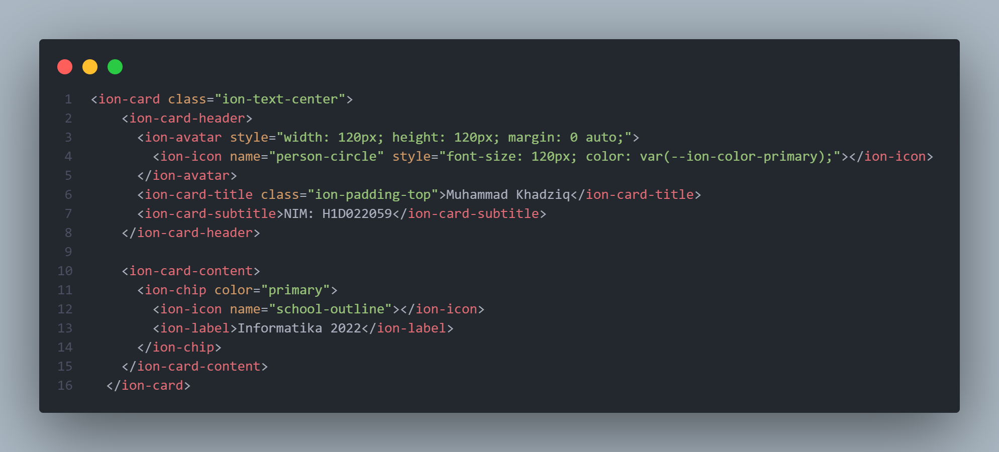

# LabMobile6_MuhammadKhadziq_ShiftC
## Screenshot Aplikasi

## Cara Menambahkan Komponen Ionic
1. Buka proyek Ionic di editor kode seperti Visual Studio Code.
2. Pilih halaman tempat menambahkan komponen, misalnya home.page.html.
3. Buka dokumentasi Ionic di https://ionicframework.com/docs/components untuk melihat daftar komponen.
4. Pilih komponen yang sesuai dengan kebutuhan, seperti ion-card, ion-button, atau ion-list.
5. Salin kode komponen dari dokumentasi dan tempelkan di file .html halaman yang dipilih.
6. Sesuaikan kode sesuai yang diinginkan, berikut saya telah menambahkan card dengan tampilkan kode yang telah disesuaikan
!
7. Tambahkan styling di file .scss halaman jika ingin mengubah tampilan komponen.
8. Jalankan proyek Ionic dengan perintah ionic serve untuk melihat hasilnya di browser.
